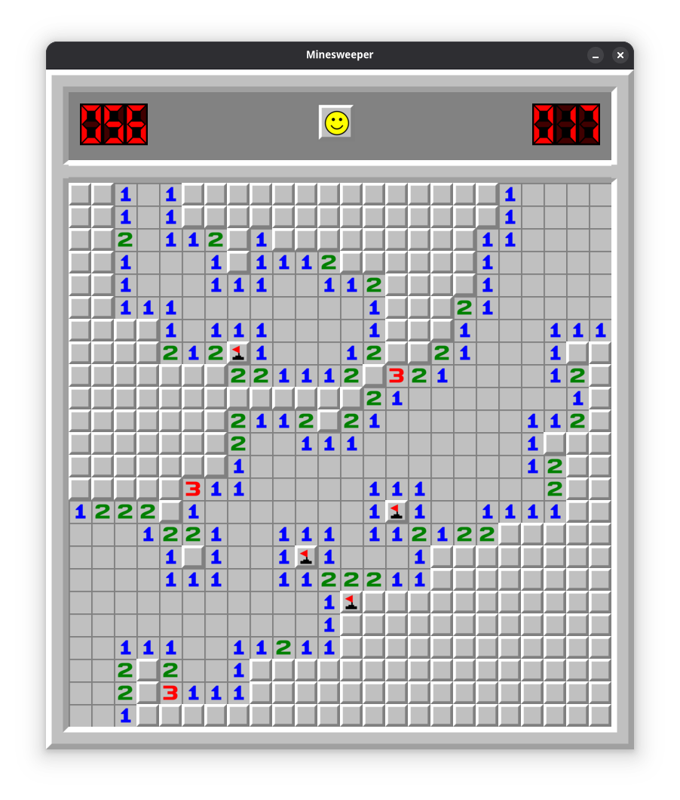

# Minesweeper: A Legendary Logic Puzzle Game 

[Minesweeper](https://en.wikipedia.org/wiki/Minesweeper_(video_game)) is a legendary logic puzzle video game, now brought to Linux! The objective of the game is simple: uncover all the tiles on the grid without triggering any hidden mines. With each tile uncovered, a number will reveal how many mines are adjacent to that tile, and using logic and deduction, players can avoid the mines while clearing the board.
 


## Minesweeper Rules
**Objective:** Clear the grid without triggering any hidden mines.

**Gameplay:**

- Click on a square to reveal what's underneath.

- If a square contains a number, it shows how many mines are in adjacent squares.

- If a square contains a mine, you lose the game.

- Right-click to flag a square you suspect contains a mine.

**Winning:** Successfully uncover all non-mined squares or flag all mines before triggering one.

## TODO
- [ ] Add an UI
- [ ] Create console version (ncurses)
- [ ] Refactor code

## Installation
Minesweeper uses [raylib](https://www.raylib.com/) for rendering, to install it for Arch linux you can type 
```
sudo pacman -S raylib
```

Then to compile game 
```
git clone https://github.com/m4kyu/Minesweeper.git
cd Minesweeper
make
```

## Usage 
For quick start just type 
```
./Minesweeper 
```
this will create a game 24*24 with 60 mines.


To start a custom game, you can run it like this  
```
./Minesweeper <width> <height> <mines count>
```